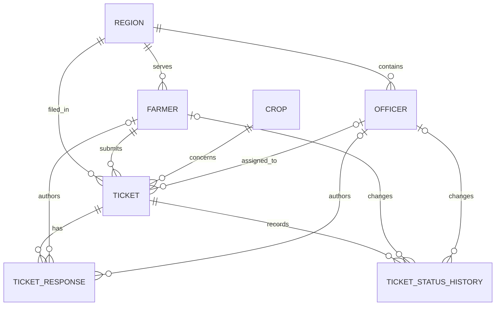

# CropAdvisor

CropAdvisor is a Java 17 and Spring Boot 3 foundation with a static, responsive landing page. The backend is intentionally an empty foundation; crop and ticket features have not been implemented.

## Requirements

- Java 17 or newer
- Maven 3.6.3 or newer, or use the included Maven Wrapper
- MySQL 8 or newer
- Visual Studio Code or IntelliJ IDEA (optional)

## Database setup

Create a local database and application user in MySQL:

```sql
CREATE DATABASE cropadvisor CHARACTER SET utf8mb4 COLLATE utf8mb4_unicode_ci;
CREATE USER 'cropadvisor'@'localhost' IDENTIFIED BY 'change-me';
GRANT ALL PRIVILEGES ON cropadvisor.* TO 'cropadvisor'@'localhost';
```

Copy `.env.example` to `.env` as a reference for your local values. Spring Boot does not automatically load `.env` files, so export the variables in your shell or add them to your IDE run configuration.

PowerShell example:

```powershell
$env:DB_URL = "jdbc:mysql://localhost:3306/cropadvisor?useSSL=false&allowPublicKeyRetrieval=true&serverTimezone=UTC"
$env:DB_USERNAME = "cropadvisor"
$env:DB_PASSWORD = "your-local-password"
```

The application reads `DB_URL`, `DB_USERNAME`, and `DB_PASSWORD`. Defaults target a local MySQL instance using the `root` account with an empty password. Flyway applies versioned migrations from `src/main/resources/db/migration`; Hibernate is configured with `ddl-auto=validate` and will fail startup if entity mappings and the migrated schema disagree. Schema changes should be introduced as new migrations. The application does not automatically reset or update tables.

## Database relationships



Each ticket has a generated internal primary key and a unique UUID ticket number. A ticket belongs to one farmer, crop, and region; it may be assigned to an officer. Responses and status transitions are separate append-oriented records, each linked to a ticket. A response must have exactly one farmer or officer author; a status transition may have at most one actor. Resolution and escalation metadata are stored on the ticket. Foreign keys, uniqueness constraints, lookup indexes, and basic database checks are included in the initial `V1` migration.

## Build and run

From this `crop` directory, run:

```powershell
.\mvnw.cmd clean test
.\mvnw.cmd package
.\mvnw.cmd spring-boot:run
```

Or with Maven installed:

```powershell
mvn clean test
mvn package
mvn spring-boot:run
```

Open <http://localhost:8080/> to view the landing page. The test suite uses an in-memory H2 database; running the application uses MySQL.

## IDE setup

### Visual Studio Code

Install a Java extension pack, open the `crop` folder (the one containing `pom.xml`), and let the Java extension import the Maven project. Set `DB_URL`, `DB_USERNAME`, and `DB_PASSWORD` in the integrated terminal before running `CropAdvisorApplication`, or add them to a VS Code launch configuration.

### IntelliJ IDEA

Open the `crop` folder as a Maven project and select a Java 17 SDK under **Project Structure**. Create a Spring Boot run configuration for `com.cropadvisor.CropAdvisorApplication`, set the three database environment variables in the configuration, and run it.

## Project layout

```text
src/main/java/com/cropadvisor/
  config/ controller/ service/ repository/
  entity/ dto/ exception/ security/ scheduler/
src/main/resources/
  application.properties
  static/index.html
  static/css/style.css
  static/js/app.js
```